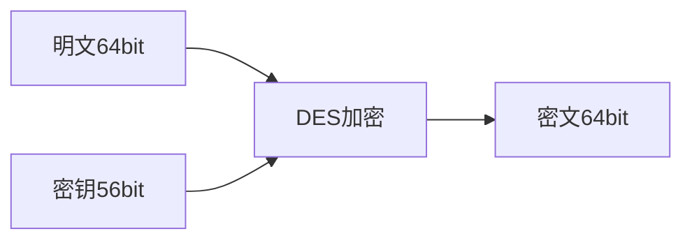

须知: 所有的加密手法都可以被破解，最差情况下使用 暴力穷举也能破解。

但， 破解成本如果很高，比如10w台计算机计算2000年可以破解，那这种加密 方式一般也认为是安全的，起码在当前的计算机算力水平下，是安全的。

## 一.古典密码学

比较原始、经典够用的密码学，现代社会基本上不用了，因为计算机的发展，古典密码学的算法很容易被破解，哪怕是暴力穷举也很容易.

- 凯撒密码 (移位加密)

  - 使用举例: 在偏移量为3时，A将会替换为D，D将会被替换为G，Z会被替换为C；明文“HIT”会被转换为密文“KLW"
  - 暴力试一下，最多也就移位26次

- 单表替换加密()

  - 原理: 与恺撒的移位加密相类似. **单表替换加密**也是逐个字母地加密明文。在加密时，将会按照某种无序的对应规则 (双方各执一份对照表, 类似二战电报的**密码本**)，并按照这个规则将明文每个字母替换而得到密文。
  - 使用举例: 如原文是ABCDEFGHIJKLMNOPQRSTUVWXYZ，替换后为SDFGHJKLZXCVBNMQWERTYUIOPA，这二者之间没有信息关联
  - 破解方式: 频率分析，英语中e,a很常用，一篇密文按照频率排序基本上就能做到破解

- 多表替换密码

  - 原理: 不再单纯地打乱字母表来加密了，而是选用某一段字符串作为其密钥，并将密钥重复若干次直到长度与明文相同
  - 使用举例: 用密钥“HAND”加密明文"ATTACKNOW"，就要将密钥重复并得到密钥排列"HANDHANDH"。密钥排列得到的一串字母，每个字母都代表以该字母作为密钥将该位置的明文字母进行移位加密，从而得到密文。
  - 破解方式: 由于加密后的字母几乎不再保持原来的频率，所以我们一般只能通过寻找算法实现对应的弱点进行破解。
    - 如果我们知道了密钥的长度，那密文就可以被看作是交织在一起的凯撒密码，而其中每一个都可以单独破解。
    - 关于密码的长度，我们可以 使用卡西斯基试验和弗里德曼试验来获取

| plainText  | A    | T    | T    | A    | C    | K    | N    | O    | W    |
| ---------- | ---- | ---- | ---- | ---- | ---- | ---- | ---- | ---- | ---- |
| key        | H    | A    | N    | D    | H    | A    | N    | D    | H    |
| cipherText | H    | T    | G    | D    | J    | K    | A    | R    | D    |

​    

  

## 二.对称密码学

1. 定义: 区别于非对称算法，对称密码学指的就是**加密和解密用的秘钥是同一个**。

   加密算法和解密算法是一对类似的算法(互为逆方法)，使用的密钥却一样。

   实际使用中，数据发送方将明文（原始数据）和密钥一起经过特殊加密算法处理后，使其变成复杂的密文发给接收方

2. 原理：对称密码当中有几种常用到的数学运算， 这些运算的共同目的就是把被加密的明文数码尽可能深地打乱，从而加大破译的难度。

   具体的运算有: 移位，置换，扩展，压缩，异或，重复迭代

3. 优点: 计算量小，加密速度快

4. 缺点: 每对用户都要使用不一样的key, 如果用户数量过多，密钥key的管理比较复杂和困难

   

### 常见算法：

#### 1. DES 

​	全称是 Data Encryption Standard

​	加密



​	解密

   ```mermaid
graph LR
密文64bit --> DES解密
密钥56bit --> DES解密
DES解密 --> 明文64bit

   ```


1. DES算法的入口参数有三个：Key、Data、Mode

  - 其中Key为8个字节共64位，是DES算法的工作密钥；但是DES每隔7 比特会设置一个错误校验位，所以真正的密钥长度是56比特。

  - Data也为8个字节64位，是要被加密或被解密的数据；

  - Mode为DES的工作方式,有两种：加密或解密

    

2. 原理:  加密主要分为两步:

  - **初始置换** : 

    - 16轮迭代，加强算法复杂度，提高破解的困难
- 每轮迭代，使用不同的子密钥 (16个，是根据密钥进行移位、迭代运算得出的)
    - 每轮迭代，数据被分为左、右两份，每份32bit, 算出的结果交换左、右位置后，作为下次迭代的输入

  - **逆置换**

3. 参考文档 [常见对称加密算法](https://www.cnblogs.com/Terry-Wu/p/10314315.html)

   [DES算法](https://zhuanlan.zhihu.com/p/136337280)

4. 5种分组模式:

   - EBC (电子密码本模式)
   - CBC (加密分组链接模式)
   - CFB  (加密反馈模式)
   - OFB  (输出反馈模式)
   - CTR

5. 破解方式和难度

   目前为止，破解方式只有暴力穷举破解

   key的长度是56bit, 所以密钥空间是2^56, 即耗时t = 2^56 / v(单位时间算力)

   假设攻击者1秒钟能计算穷举100万个密钥，也需要大概2000年才能破解；

   但随着当今社会计算力的提升 ，再加上出现了超级计算机&分布式计算系统，所以DES还是有可能被暴力破解的

#### 2.  3DES

1. 因为DES很容易被破解，所以开发出了3DES算法， 即将DES的算法重复三次得到的一种密码算法


2. 目的:

   - 兼容普通DES算法，如果3次加密的密钥一样，3DES就=DES
   - 密钥长度变成 56 * 3 = 168, 密钥空间 = 2^168

3. 4种模式：
  - DES-EEE3 模式：该模式中共使用3个不同密钥，顺序使用3次DES加密算法。

  - DES-EDE3 模式：该模式中共使用3个不同密钥，依次用加密—解密—加密。

  - DES-EEE2 模式：该模式中共使用2个不同密钥，顺序使用3次DES加密算法，其中第一次和第三次加密使用的密钥相同。

  - DES-EDE2 模式：该模式中共使用2个不同密钥，依次用加密—解密—加密，其中加密算法使用的密钥相同。

4. 破解难度：

    集齐全世界的计算机，也几乎算不出来

#### 3. AES

 1. 2002年替代DES，成为美国国家标准与技术研究院 的推荐标准

 2. 区别: 密钥长度为128, 192 或256位，相应的迭代次数为10, 12, 14轮 ，

 3. 原理:

    计算方式新增了: SubBytes（字节替代）、ShiftRows（行移位）、MixColumns（列混淆）、AddRoundKey(轮密钥加）KeyExtension（密钥扩展）

 4. 破解难度:

     其对应的密钥空间也随之变大，最大近似2^256，近乎太阳毁灭也算不出来

## 三.非对称密码学

1. 定义: 非对称密码学指的就是**加密和解密用的秘钥是同一个**
2. 原理：
3. 使用示例：
4. 常见算法：

## 四.常见的攻击方式&应对方法

