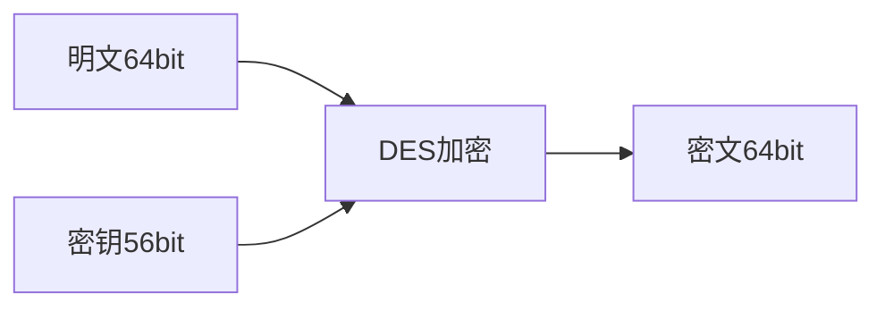

须知: 所有的加密手法都可以被破解，最差情况下使用 暴力穷举也能破解。

但， 破解成本如果很高，比如10w台计算机计算2000年可以破解，那这种加密 方式一般也认为是安全的，起码在当前的计算机算力水平下，是安全的。

但，随着技术和数学的发展，很可能某个算法找到更好的思路破解，就不需要穷举了 


和很多文章一样，本文假设场景是:

Bob和Susan是好朋友，Bob要和Susan经常通信，但是有个坏蛋Dog,一直处心积虑想破解&攻击他们的通信

## 一.古典密码学

比较原始、经典够用的密码学，现代社会基本上不用了，因为计算机的发展，古典密码学的算法很容易被破解，哪怕是暴力穷举也很容易.

- 凯撒密码 (移位加密)

  - 使用举例: 在偏移量为3时，A将会替换为D，D将会被替换为G，Z会被替换为C；明文“HIT”会被转换为密文“KLW"
  - 暴力试一下，最多也就移位26次

- 单表替换加密()

  - 原理: 与恺撒的移位加密相类似. **单表替换加密**也是逐个字母地加密明文。在加密时，将会按照某种无序的对应规则 (双方各执一份对照表, 类似二战电报的**密码本**)，并按照这个规则将明文每个字母替换而得到密文。
  - 使用举例: 如原文是ABCDEFGHIJKLMNOPQRSTUVWXYZ，替换后为SDFGHJKLZXCVBNMQWERTYUIOPA，这二者之间没有信息关联
  - 破解方式: 频率分析，英语中e,a很常用，一篇密文按照频率排序基本上就能做到破解

- 多表替换密码

  - 原理: 不再单纯地打乱字母表来加密了，而是选用某一段字符串作为其密钥，并将密钥重复若干次直到长度与明文相同
  - 使用举例: 用密钥“HAND”加密明文"ATTACKNOW"，就要将密钥重复并得到密钥排列"HANDHANDH"。密钥排列得到的一串字母，每个字母都代表以该字母作为密钥将该位置的明文字母进行移位加密，从而得到密文。
  - 破解方式: 由于加密后的字母几乎不再保持原来的频率，所以我们一般只能通过寻找算法实现对应的弱点进行破解。
    - 如果我们知道了密钥的长度，那密文就可以被看作是交织在一起的凯撒密码，而其中每一个都可以单独破解。
    - 关于密码的长度，我们可以 使用卡西斯基试验和弗里德曼试验来获取

| plainText  | A    | T    | T    | A    | C    | K    | N    | O    | W    |
| ---------- | ---- | ---- | ---- | ---- | ---- | ---- | ---- | ---- | ---- |
| key        | H    | A    | N    | D    | H    | A    | N    | D    | H    |
| cipherText | H    | T    | G    | D    | J    | K    | A    | R    | D    |

​    

  

## 二.对称密码学

1. 定义: 区别于非对称算法，对称密码学指的就是**加密和解密用的秘钥是同一个**。

   加密算法和解密算法是一对类似的算法(互为逆方法)，使用的密钥却一样。

   实际使用中，数据发送方将明文（原始数据）和密钥一起经过特殊加密算法处理后，使其变成复杂的密文发给接收方

2. 原理：对称密码当中有几种常用到的数学运算， 这些运算的共同目的就是把被加密的明文数码尽可能深地打乱，从而加大破译的难度。

   具体的运算有: 移位，置换，扩展，压缩，异或，重复迭代

3. 优点: 计算量小，加密速度快

4. 缺点: 每对用户都要使用不一样的key, 如果用户数量过多，密钥key的管理比较复杂和困难

   

### 常见算法：

#### 1. DES 

​	全称是 Data Encryption Standard

​	加密



​	解密

   ```mermaid
graph LR
密文64bit --> DES解密
密钥56bit --> DES解密
DES解密 --> 明文64bit

   ```


1. DES算法的入口参数有三个：Key、Data、Mode

  - 其中Key为8个字节共64位，是DES算法的工作密钥；但是DES每隔7 比特会设置一个错误校验位，所以真正的密钥长度是56比特。

  - Data也为8个字节64位，是要被加密或被解密的数据；

  - Mode为DES的工作方式,有两种：加密或解密

    

2. 原理:  加密主要分为两步:

  - **初始置换** : 

    - 16轮迭代，加强算法复杂度，提高破解的困难
- 每轮迭代，使用不同的子密钥 (16个，是根据密钥进行移位、迭代运算得出的)
    - 每轮迭代，数据被分为左、右两份，每份32bit, 算出的结果交换左、右位置后，作为下次迭代的输入

  - **逆置换**

3. 参考文档 [常见对称加密算法](https://www.cnblogs.com/Terry-Wu/p/10314315.html)

   [DES算法](https://zhuanlan.zhihu.com/p/136337280)

4. 5种分组模式:

   - EBC (电子密码本模式)
   - CBC (加密分组链接模式)
   - CFB  (加密反馈模式)
   - OFB  (输出反馈模式)
   - CTR

5. 破解方式和难度

   目前为止，破解方式只有暴力穷举破解

   key的长度是56bit, 所以密钥空间是2^56, 即耗时t = 2^56 / v(单位时间算力)

   假设攻击者1秒钟能计算穷举100万个密钥，也需要大概2000年才能破解；

   但随着当今社会计算力的提升 ，再加上出现了超级计算机&分布式计算系统，所以DES还是有可能被暴力破解的

#### 2.  3DES

1. 因为DES很容易被破解，所以开发出了3DES算法， 即将DES的算法重复三次得到的一种密码算法


2. 目的:

   - 兼容普通DES算法，如果3次加密的密钥一样，3DES就=DES
   - 密钥长度变成 56 * 3 = 168, 密钥空间 = 2^168

3. 4种模式：
  - DES-EEE3 模式：该模式中共使用3个不同密钥，顺序使用3次DES加密算法。

  - DES-EDE3 模式：该模式中共使用3个不同密钥，依次用加密—解密—加密。

  - DES-EEE2 模式：该模式中共使用2个不同密钥，顺序使用3次DES加密算法，其中第一次和第三次加密使用的密钥相同。

  - DES-EDE2 模式：该模式中共使用2个不同密钥，依次用加密—解密—加密，其中加密算法使用的密钥相同。

4. 破解难度：

    集齐全世界的计算机，也几乎算不出来

#### 3. AES

 1. 2002年替代DES，成为美国国家标准与技术研究院 的推荐标准

 2. 区别: 密钥长度为128, 192 或256位，相应的迭代次数为10, 12, 14轮 ，

 3. 原理:

    计算方式新增了: SubBytes（字节替代）、ShiftRows（行移位）、MixColumns（列混淆）、AddRoundKey(轮密钥加）KeyExtension（密钥扩展）

 4. 破解难度:

     其对应的密钥空间也随之变大，最大近似2^256，近乎太阳毁灭也算不出来

## 三.非对称密码学

1. 定义: 加密和[解密](https://baike.baidu.com/item/解密/4409)使用的是两个不同的密钥；用公钥对数据进行加密，只有用对应的私钥才能解密

   

2. 使用示例：

   A有自己的私钥，公钥可以公开给所有人

   B使用公钥加密后，传给A

   A使用私钥解 (没有私钥的人无法解密)

3. 特点: 算法强度复杂、安全性依赖于算法与密钥

   但是由于其算法复杂，而使得加密解密速度没有对称加密解密的速度快，一般情况下，慢1000+倍

   

### 常见算法：

- RSA

  - 原理: 

     该算法基于一个十分简单的数论事实：将两个大素数相乘十分容易，但想要对其乘积进行因式分解却极其困难，**因此可以将乘积公开作为加密密钥，即公钥，而两个大素数组合成私钥**

  - 密钥长度:  
  
    1999年512bit被破解， 2007年768bit被破解，所以基本认为1024bit的密钥基本安全，2048bit的密钥极其安全
  
    参考 [<<RSA算法探秘>>](https://zhuanlan.zhihu.com/p/75167507)
  
  - 结论:  
  
    使用公钥加密，私钥解密是最常用的； 
  
    使用私钥加密，公钥解密理论上也可行，但是安全性上差了一些
  
  - 举例: 
  
    ```java
    取一对互质的数比如p, q， p = 61， q = 53
    
    1. n = p * q = 61 * 53 = 3233
    
    2. 欧拉n = (p-1) * (q-1) = 60 * 52 = 3120
    
    3. 求e；要求 1 < e < 欧拉n  且 e 和 欧拉n 互质； 数有很多，比如17
    
    e = 17
    
    4. 求d；要求  e * d % 欧拉n = 1
    
    转化公式 x * e + 欧拉n * y = 1 ； 17x + 3120y = 1 ； 算出x = 2753，y = -15
    
    验证要求  17 * 2753 % 3120 = 1
    
    d = 2753
    
    5.
    
    钥匙A为： n和e
    
    钥匙B为： n和d
    
    
    用钥匙A加密 123
    
    123 ** e % n = 123 ** 17 % 3233 = 855
    
    用钥匙B解密 855
    
    855 ** d % n = 855 ** 2753 % 3233 = 123
    
    
    
    用钥匙B加密 99
    
    99 ** d % n = 99 ** 2753 % 3233 = 89
    
    用钥匙A解密 89
    
    89 ** e % n = 89 ** 17 % 3233 = 99
    ```
  
    - 总结
  
      不知道pq的情况下：
  
      钥匙A 不hen能nan 算出 钥匙B
  
      钥匙B 也不hen能nan 算出 钥匙A
  
    >  e和d 哪个标记为公钥，在性能和安全性上 有差别，d的位数比较大,难以破解，so通常e被标记为公钥

## 四.数字摘要

1. 定义： **数字摘要**是将任意长度的消息变成**固定长度**（比如128bit）的短消息。

   它类似于一个自变量是消息的函数， 也就是Hash函数。

2. 安全性： 一个Hash函数的好坏是由发生碰撞的概率决定的。如果攻击者能够轻易地构造出两个消息具有相同Hash，那么这样的Hash函数是很危险的.

   一般来说，安全Hash标准的输出长度为160位，这样才能保证它足够的安全。 这一加密方法亦称安全Hash编码法

   （SHA:Secure Hash Algorithm）或MD5(MD Standards for Message Digest) [**但MD5在2004年被业界认为不够安全，不适用于安全验证的环节，替代品是SHA2**]

3. 加盐(salt): 

   **盐（Salt），在密码学中，是指在散列之前将散列内容（例如：密码）的任意固定位置插入特定的字符串。**这个在散列中加入字符串的方式称为 “加盐”。

   其作用是让加盐后的散列结果和没有加盐的结果不相同，在不同的应用情景中，这个处理可以增加额外的安全性。

   > **在大部分情况，盐是不需要保密的。盐可以是随机产生的字符串，其插入的位置可以也是随意而定。**如果这个散列结果在将来需要进行验证（例如：验证用户输入的密码），则需要将已使用的盐记录下来

4. 流程

   - 将text扩充至512的整数倍
   - 每512bit为一个分组
   - 每个分组分为16个32bit的子分组
   - 4个初始化的值，格式为16进制128bit数据
   - 定义4个不同的、包含位移、异或、与等逻辑运算的函数a,b,c,d， 作用是将初始化的值和部分子分组作逻辑运算
   - 每次的输出作为下次迭代的输入，进入下一轮迭代。
   - 将生成的最后a,b,c,d拼接而成result

5. 参考文档[[一文读懂 MD5 算法](https://segmentfault.com/a/1190000021691476)]、[[MD5算法解析](https://zhuanlan.zhihu.com/p/110063025)]

## 五.数字签名

1. 定义: 数字签名是非对称加密技术与数字摘要技术的应用。

2. 和非对称加密的关系和区别

   **公钥加密，私钥解密。**

   **私钥数字签名，公钥验证。**

3. 目的: 防止内容被篡改，

   **注意** ：数字签名算法只能解决网络or通信信道不安全的问题。

   如果 自己的计算机已经被控制、侵入了 ，黑客随便修改啥都行。

   这种情况下，啥加密都没用，人家想改根证书就改根证书，想改你网络收到的数据就改，甚至可以替换程序的代码。

4. 流程 

   - Bob使用适当的hash()，将文本text做一下"摘要"digest，目的: 缩小内容的体积。
   - Bob使用私钥，对摘要digest加密，得到"数字签名"signature
   - Bob发消息给Susan, 将文本text 和 signature一起发送
   - Susan拿到数据后，使用公钥对signature解密，得到摘要digest
   - Susan使用相同的hash()算法，对Text做一下摘要digest2，如果digest == digest2，就认为数据是正常的、没被修改过的

   参考文章[<<数字签名是什么？>>](http://www.ruanyifeng.com/blog/2011/08/what_is_a_digital_signature.html)

5. 攻击方式:

   **中间人\代理攻击** ：Dog想办法替换了公钥，让Susan认为，现在的公钥，就是Bob的公钥，

   ​	这样Dog用自己的私钥签名的数据，就能用被替换的公钥验证通过

   **应对方式** ：使用证书(CA)做公证。

6. 数字签名证书:

   - Bob向有信誉的大公司，申请数字证书
   - 大公司使用自己私钥，将Bob的公钥加密，生成**"数字证书"**发给Bob
   - 在和 Susan通信时，Bob将text, sinature和证书一起发给Susan
   - Susan收到后，使用大公司的公钥将证书解密，获得到真实的公钥(大家一般都内置很多可信赖的大公司的公钥，比如Google)

## 六.HTTPS协议 - 数字签名的应用

《图解HTTP》这本书中曾提过, HTTPS是身披SSL外壳的HTTP. 主要目的是提供对网站服务器的身份认证，同时保护交换数据的隐私与完整性。

> TLS是传输层加密协议，前身是SSL协议，由网景公司(Netscape)1995年发布，有些语境下两者可认为是一样的。
>
> 其中，SSL1.0-3.0因为存在的安全漏洞，基本上都弃用了，TLS1.0同样； 比较常用的是TLS1.1和1.2

如果有时间， 可以通过抓包观察HTTPS的传输， 可以看到数据不是明文传输，且具有如下特点：

1. 内容加密：采用混合加密技术，中间者无法直接查看明文内容
2. 验证身份：通过证书认证客户端访问的是自己的服务器
3. 保护数据完整性：防止传输的内容被中间人冒充或者篡改

具体内容略 ，详见 [HTTPS](../协议/HTTPS)

## 七.常见的攻击方式&应对方法

